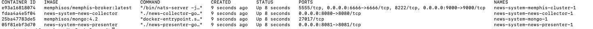
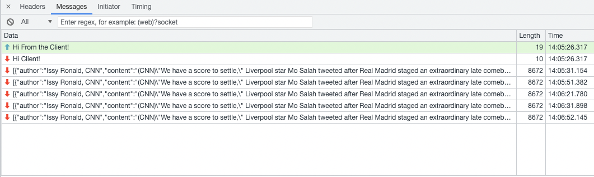
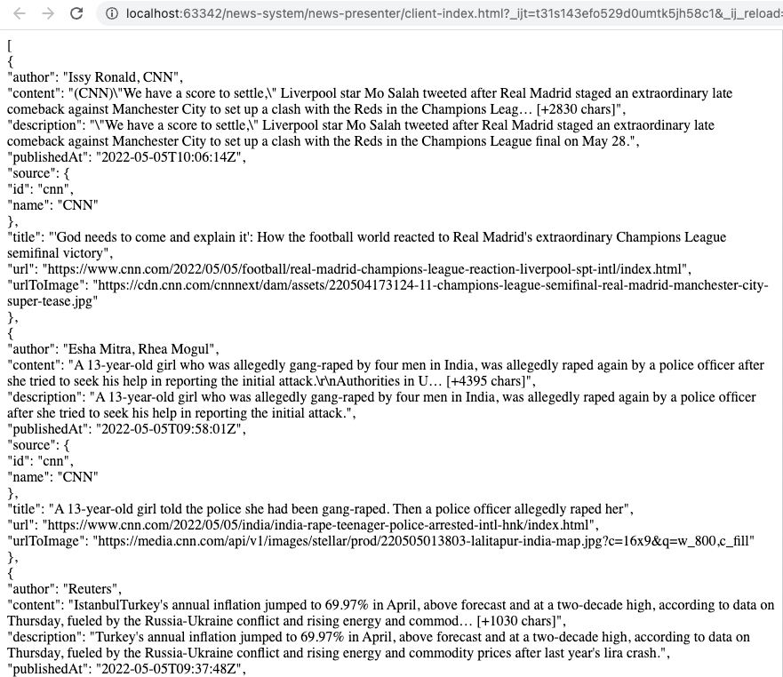

# news-system

A system is composed of three modules:

1. [news-collector](./news-collector)
* Collecting news from some predefined sources
(e.g [NewsAPI](https://documenter.getpostman.com/view/3479169/Szf7zncp?version=latest#intro), [TheGuardianNews](https://content.guardianapis.com))
* Publish the batch of news into [memphis broker](https://github.com/memphisdev/memphis-broker)

2. [news-presenter](./news-presenter)
* Consume the batch of news from [memphis broker](https://github.com/memphisdev/memphis-broker)
* Expose that data over websocket with predefined port

3. [memphis-broker](https://github.com/memphisdev/memphis-broker)
*  Provides end-to-end support for in-app streaming use cases using Memphis distributed message broker.

## _Customization of behaviour_
To customize 
behaviour or change config kinda values(_scrape interval, switching source of news, external system credentials etc._)

Please refer to environment variables(e.g [news-collector environment variables](./news-collector/.env.local)) and configuration files(e.g [news-collector config file](./news-collector/config/config.json)).

## _Testing on Docker_

1. First clone the application into your machine

``git clone https://github.com/egasimov/news-system.git``

2. Make sure that docker already installed and running

``docker info``

3. Use docker-compose to run the application in your machine (_P:S it might take some time_)

``docker-compose -f ./docker-compose.yml up -d``

4. Verify containers are properly running on machine.

``docker ps``

5. Open [simple file](./news-presenter/client-index.html) in the browser, and verify it is working

``open ./news-presenter/client-index.html``

## _Testing on K8s_
1. First clone the application into your machine

``git clone https://github.com/egasimov/news-system.git``

2. Make sure that kubernetes already configured and running, kubectl properly configured with k8s

``kubectl cluster-info``

4. Make sure that memphis already configured and running properly

``helm repo add memphis https://k8s.memphis.dev/charts/ --force-update && helm install memphis memphis/memphis --create-namespace --namespace memphis``

Memphis Deployment Information
### Secrets ###
UI/CLI/SDK root username        - root

UI/CLI root Password            - kubectl get secret memphis-creds -n memphis -o jsonpath="{.data.ROOT_PASSWORD}" | base64 --decode

SDK root connection token       - kubectl get secret memphis-creds -n memphis -o jsonpath="{.data.CONNECTION_TOKEN}" | base64 --decode

Replace MEMPHIS_TOKEN(in [k8s-deployment.yml](./k8s-deployment.yaml)) with value from SDK root connection token.

5.Use and apply below deployment file 

``kubectl apply -f k8s-deployment.yaml``

6.Verify pods are properly running on machine.

``docker ps``

7. Do port forwarding from k8s to your local machine to test it.

``kubectl port-forward service/news-presenter-go-svc 8081:80 --namespace news-system``

8. Open [simple file](./news-presenter/client-index.html) in the browser, and verify it is working

``open ./news-presenter/client-index.html``

## Result:

